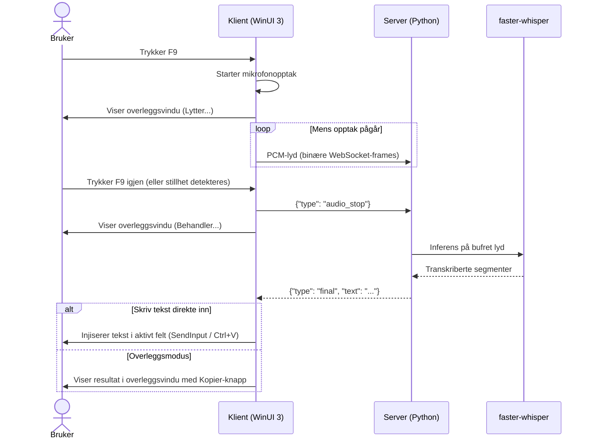

# LocalWhisperer

Tale-til-tekst for Windows — fungerer i alle inputfelt i alle applikasjoner. En systemstatusfelts-app (WinUI 3 / .NET 10) som strømmer mikrofonlyd over WebSocket til en transkripsjonsserver som kjører [faster-whisper](https://github.com/SYSTRAN/faster-whisper). Serveren kan kjøre lokalt eller på en annen maskin i lokalnettet.

Standardmodell: **NbAiLab/nb-whisper-medium** — optimalisert for norsk.

---

## Slik fungerer det

1. Trykk **F9** (hold inne for hold-to-talk, eller trykk for å veksle) — et overleggsvindu vises nederst på skjermen
2. Snakk — en live lydnivåindikator viser at mikrofonen er aktiv
3. Slipp / trykk igjen for å stoppe — serveren transkriberer og resultatet vises med en **Kopier**-knapp

**Valgfritt: auto-send ved stillhet** — aktiver i Lyd-innstillingene for kontinuerlig diktering. Serveren transkriberer automatisk ved hver pause, og teksten akkumuleres i overleggsvinduet mens mikrofonen forblir åpen. Trykk hurtigtasten for å avslutte.

Klienten strømmer rå 16kHz PCM-lyd over WebSocket under opptak. Når opptaket stoppes (eller ved en stillhetspause), kjører serveren en inferenspass på den bufrede lyden og returnerer transkripsjonen.



---

## Prosjektstruktur

```
LocalWhisperer/
├── client/                          # C# / WinUI 3 / .NET 10 Windows-klient
│   └── LocalWhisperer/
│       ├── App.xaml(.cs)            # Oppstart, systemstatusfeltet, global hurtigtast
│       ├── MainWindow.xaml(.cs)     # Innstillingsvindu (NavigationView)
│       ├── Pages/                   # Innstillingssider (Tilkobling, Hurtigtast, Modell, Lyd, Om)
│       ├── Services/
│       │   ├── AudioCaptureService.cs
│       │   ├── WebSocketService.cs
│       │   ├── HotkeyService.cs
│       │   ├── TranscriptionOrchestrator.cs
│       │   ├── SettingsService.cs
│       │   └── ServerApiService.cs
│       └── Helpers/NativeMethods.cs # P/Invoke (SendInput, tastatturhook)
└── server/                          # Python-transkripsjonsserver
    ├── server.py
    ├── transcriber.py
    ├── config.py
    ├── config.yaml                  # Hovedkonfigurasjon (versjonskontrollert)
    ├── secrets.yaml                 # HuggingFace-token — IKKE versjonskontrollert (se nedenfor)
    ├── secrets.yaml.example
    ├── requirements.txt
    └── test_client.py
```

---

## Klient

### Krav

- Windows 10 1809 (build 17763) eller nyere
- .NET 10 SDK (for å bygge fra kildekode)

### Bygg

```powershell
cd client
dotnet build LocalWhisperer/LocalWhisperer.csproj -r win-x64
```

### Publiser (selvdistribuert mappe)

```powershell
cd client
dotnet publish LocalWhisperer/LocalWhisperer.csproj -r win-x64 -c Release --self-contained -o publish
```

Kopier `publish\`-mappen til målmaskinen og kjør `LocalWhisperer.exe`. Ingen installasjon nødvendig.

### Bruk

Ved første oppstart starter appen i systemstatusfeltet (intet vindu vises). Ikonet indikerer tilstand:

| Ikon | Tilstand |
|---|---|
| 🟢 Grønn sirkel | Tilkoblet / inaktiv |
| 🔴 Rød sirkel | Tar opp |
| ⬛ Mørk grå firkant | Frakoblet |

**Høyreklikk** på ikonet for kontekstmenyen. **Venstreklikk** åpner innstillingsvinduet.

#### Innstillinger

| Side | Beskrivelse |
|---|---|
| **Tilkobling** | Server-URL, koble til/fra |
| **Hurtigtast** | Aktiv hurtigtast (F9), hold-to-talk-veksling |
| **Modell** | Bytt transkripsjonmsodell under kjøring |
| **Lyd** | Velg mikrofon, auto-kopier til utklippstavle, auto-send ved stillhet |
| **Visning** | Posisjon for overleggsvindu (høyre, midten, venstre) |
| **Korreksjoner** | Ord- og fraseerstatninger som anvendes på transkripsjonen |
| **Generelt** | Start/avslutning per segment, tekstinnlimingsmetode |
| **Om** | Om appen |

Innstillinger lagres automatisk mellom økter.

#### Hurtigtast

Standard: **F9**

To moduser (konfigurerbart på Hurtigtast-siden):
- **Veksle** (standard) — trykk én gang for å starte, trykk igjen for å stoppe
- **Hold-to-talk** — hold tasten inne mens du snakker, slipp for å stoppe

> Tips: Aktiver **Kopier automatisk til utklippstavle** på Lyd-siden for å hoppe over det manuelle kopieringstrinnet — resultatet kopieres automatisk når opptaket stopper.

> Tips: Aktiver **Auto-send ved stillhet** på Lyd-siden for kontinuerlig diktering — transkriberte tekster akkumuleres i overleggsvinduet mens du snakker og pauser naturlig. Bruk **Avslutning per segment** for å styre hvordan pausene settes sammen: mellomrom (sammenhengende tekst), enkelt linjeskift eller dobbelt linjeskift (avsnittsskift).

---

## Server

### Krav

- Python 3.10+

### Installer

```bash
cd server
python -m venv .venv
.venv\Scripts\activate      # Windows
# source .venv/bin/activate   # macOS / Linux
pip install -r requirements.txt
```

### HuggingFace-token (valgfritt)

Kreves kun for lukkede modeller. Unngår hastighetsbegrensning ved første nedlasting.

1. Hent et skrivebeskyttet token på <https://huggingface.co/settings/tokens>
2. `cp secrets.yaml.example secrets.yaml`
3. Erstatt `hf_YOUR_TOKEN_HERE` med ditt token

`secrets.yaml` er i `.gitignore` og vil aldri bli versjonskontrollert.

### Konfigurasjon

Rediger `config.yaml`:

```yaml
transcription:
  default_model: "NbAiLab/nb-whisper-medium"
  device: "cpu"        # "auto" | "cuda" | "cpu"
  compute_type: "int8" # "int8" for CPU, "float16" for GPU
```

Tilgjengelige modeller:

| Modell | Merknader |
|---|---|
| `NbAiLab/nb-whisper-small` | Rask, mindre nøyaktig |
| `NbAiLab/nb-whisper-medium` | Anbefalt |
| `NbAiLab/nb-whisper-large` | Beste kvalitet, treg på CPU |
| `openai/whisper-large-v3` | Flerspråklig |

### Start

```bash
cd server
.venv\Scripts\activate
uvicorn server:app --host 0.0.0.0 --port 8765
```

Den valgte modellen lastes ned fra HuggingFace ved første kjøring (~1–3 GB). Påfølgende starter bruker lokal hurtigbuffer.

### REST-endepunkter

| Endepunkt | Metode | Beskrivelse |
|---|---|---|
| `/health` | GET | Status, gjeldende modell, enhet |
| `/models` | GET | List tilgjengelige modeller |
| `/models/switch` | POST | Bytt modell under kjøring |
| `/config` | GET | Full konfigurasjon |

```bash
curl http://localhost:8765/health
```

---

## Testklient

Verifiser serveren uten Windows-klienten:

```bash
# Tilkoblingstest (3 sekunder stillhet)
python test_client.py

# Strøm en WAV-fil
python test_client.py sti/til/lyd.wav

# Ekstern server
python test_client.py --url ws://192.168.1.x:8765/ws/transcribe sti/til/lyd.wav
```

Forventet utdata:
```
[final  ] 'Hei, dette er en test av talestyring.'  (1243ms)
```

---

## Kjente begrensninger

- Transkripsjon kjøres etter at opptaket stopper (eller per stillhetspause med auto-send) — lengre opptak mellom pauser betyr lengre ventetid for hvert resultat.
- faster-whisper støtter ikke Metal/MPS — macOS bruker CPU med int8.
- Den globale tastatturhoken (`WH_KEYBOARD_LL`) kan bli blokkert i noen bedriftsmiljøer.
